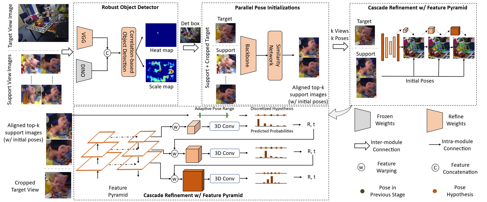
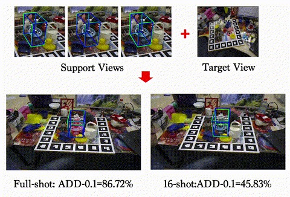

<div align="center">
<h1>[3DV24] Cas6D: Learning to Estimate 6DoF Pose from Limited Data: A Few-Shot, <br> Generalizable Approach using RGB Images </h1>

[[Paper: Arxiv]](https://ieeexplore.ieee.org/abstract/document/10550594) 


<div>
        <a href="https://paulpanwang.github.io/">Panwang Pan</a><strong><sup>1,*</sup></strong>,
        <a href="https://zhiwenfan.github.io/">Zhiwen Fan</a><strong><sup>2,*</sup></strong>,
        <a href="https://brandonyfeng.github.io/">Brandon Y. Feng</a><strong><sup>3,*</sup></strong>,
        <a href="https://peihaowang.github.io/">Peihao Wang</a><strong><sup>2</sup></strong>,
        <a href="https://xggnet.github.io/">Chenxin Li</a><strong><sup>4</sup></strong>,
        <a href="https://vita-group.github.io/">Zhangyang Wang</a><strong><sup>2</sup></strong>
</div>
 <div>
    <sup>1</sup>ByteDance &emsp; 
    <sup>2</sup>The University of Texas at Austin &emsp;
    <sup>3</sup>MIT &emsp;
    <sup>4</sup>The Chinese University of Hong Kong &emsp;
    <sup>*</sup>denotes equal contribution
</div>




</div>
We present a new cascade framework named Cas6D for few-shot 6DoF pose estimation that is generalizable and uses only RGB images.


## Training
1. Download processed [co3d](https://ai.facebook.com/datasets/CO3D-dataset/) data (co3d.tar.gz), [google scanned objects](https://arxiv.org/abs/2204.11918) data (google_scanned_objects.tar.gz) and [ShapeNet](http://shapenet.org/) renderings (shapenet.tar.gz) at [here](https://connecthkuhk-my.sharepoint.com/:f:/g/personal/yuanly_connect_hku_hk/EkWESLayIVdEov4YlVrRShQBkOVTJwgK0bjF7chFg2GrBg?e=Y8UpXu).
2. Download [COCO](https://cocodataset.org/#download) 2017 training set.
3. Organize files like
```shell
Gen6D
|-- data
    |-- GenMOP
        |-- chair 
            ...
    |-- LINEMOD
        |-- cat 
            ...
    |-- shapenet
        |-- shapenet_cache
        |-- shapenet_render
        |-- shapenet_render_v1.pkl
    |-- co3d_256_512
        |-- apple
            ...
    |-- google_scanned_objects
        |-- 06K3jXvzqIM
            ...
    |-- coco
        |-- train2017
4. Train the detector
```shell
python3 train_model.py --cfg configs/detector/detector_train.yaml
```
5. Train the selector
```shell
python3 train_model.py --cfg configs/selector/selector_train.yaml
```
6. Prepare the validation data for training refiner
```shell
python3 prepare.py --action gen_val_set \
                  --estimator_cfg configs/gen6d_train.yaml \
                  --que_database linemod/cat \
                  --que_split linemod_val \
                  --ref_database linemod/cat \
                  --ref_split linemod_val

python3 prepare.py --action gen_val_set \
                  --estimator_cfg configs/gen6d_train.yaml \
                  --que_database genmop/tformer-test \
                  --que_split all \
                  --ref_database genmop/tformer-ref \
                  --ref_split all 
```
This command will generate the information in the `data/val`, which will be used in producing validation data for the refiner.
7. Train the refiner
```shell
python3 train_model.py --cfg configs/refiner/refiner_train.yaml
```


## Evaluate all components together.
```shell
# Evaluate on the object TFormer from the GenMOP/LINEMOD dataset
python3 eval.py --cfg configs/cas6d_train.yaml 

```


## Acknowledgement

We would like to thank [Gen6D](https://github.com/liuyuan-pal/Gen6D) authors for open-sourcing their implementations.


## Citation

If you find this repo is helpful, please consider citing:
```bibtex
@article{pan2023learning,
  title={Learning to Estimate 6DoF Pose from Limited Data: A Few-Shot, Generalizable Approach using RGB Images},
  author={Pan, Panwang and Fan, Zhiwen and Feng, Brandon Y and Wang, Peihao and Li, Chenxin and Wang, Zhangyang},
  journal={arXiv preprint arXiv:2306.07598},
  year={2023}
}

```


